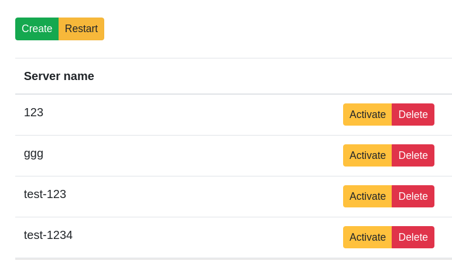
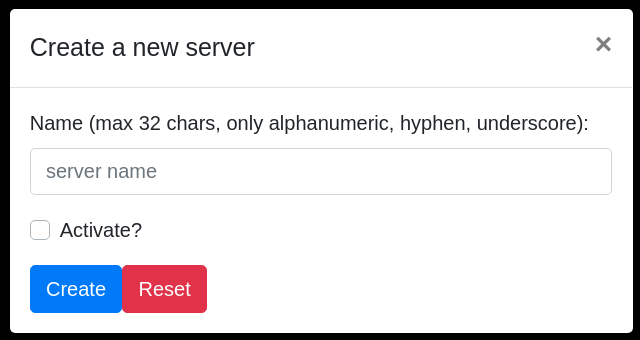

# mc-server-manager

The main goal of this project is to manage Minecraft server instances on
a container / virtual machine / physical server **having only 1 instance running at a time**.

### Requirements

- Any systemd-powered Linux server with Minecraft server installed.
- Python 3.8
- Installed libraries from **requirements.txt**

### Usage

**via CLI**:

- enter **backend** directory
- test script installation and configuration: `./manage.py test`
- activate specified server: `./manage.py activate --server_name=<server_name>`
- stop server: `./manage.py stop`
- start server: `./manage.py start`
- restart server: `./manage.py restart`
- secure server: `./manage.py secure --server_name=<server_name>`
- create a new server from template: `./manage.py create --server_name=<server_name>`

**via API**:

- start server (will bind to 8000 port): `cd backend; python app.py`
- api methods:
    - /health (GET)
    - /get_servers (GET)
    - /activate_server (POST, GET: <server_name=server_name>)
    - /delete_server (DELETE: <server_name=server_name>)
    - /create_server (PUT: <server_name=server_name>)
    - /secure_server_instance (POST, GET: <server_name=server_name>)

**via UI**:

### Installation and configuration

1. clone this repository
1. copy **minecraft-server.service** to the **/USER_HOMEDIR/.config/systemd/user/minecraft-server.service
1. edit above service file to match your environment and needs
1. install required Python libraries (`pip install --user -r requirements.txt`)
1. confirm everything works fine: `cd backend; ./manage.py test` - this should list all servers found in **USER_HOMEDIR/servers-data directory** as well as should display current state of the Minecraft server.
1. copy **config.ini.template** to **/USER_HOMEDIR/.minecraft/mc-manager-config** and edit its contents to match your environment**

### High level overview

The main goal of this project is to provide user with a tool (CLI and UI) for managing many MC server instances within one Linux server instance.

### Under the hood - how it works?

Main assumptions are:

1. Linux server instance is powered with systemd
1. Minecraft server is installed in **/USER_HOMEDIR/minecraft-server**
1. Servers data directory is in **/USER_HOMEDIR/servers-data**
1. There is also a copy of **srv-template** directory (provided in this repo) under **/USER_HOMEDIR/srv-template**
1. A systemd unit service is created in **/USER_HOMEDIR/.config/systemd/user/minecraft-server.service** and managed by this user (without a need for elevated permissions)

Now, in order to create a new server scripts/API basically copy all files from **srv_template** to a new subdirectory under **servers-data** (e.g. **servers-data/new-server**).

In order to activate a server script will remove all symlinks from **minecraft-server** directory and create new ones pointing at **servers-data/new-server**. Afterwards it will restart **minecraft-server.service** service.

### Server template

Server template is basically a list of files that are customized per server instance and belongs to a specific server instance. All other files (binaries, libraries) are common.

- Server template files (that will be symlinked):
    - banned-ips.json
    - banned-players.json
    - bukkit.yml
    - commands.yml
    - crash-reports
    - logs  ops.json
    - permissions.yml
    - server.properties
    - spigot.yml
    - usercache.json
    - whitelist.json
    - world
    - world_nether
    - world_the_end

### Minecraft server versions

For now the whole machinery make a naive assumption that every server instance works on the same Minecraft server version.

### Development

#### Backend / API

All backend components are stored inside of **backend** directory.

For development purposes there is a **minecraft-server-stub.service** in this repo which might be used for testing various server scenarios.

API server uses [Flask-API](https://www.flaskapi.org/) library. 

Developing backend services requires Python 3.8 and libraries installed from **requirements.txt**. Using [pyenv](https://github.com/pyenv/pyenv) is recommended.

In order to start API server:

`cd backend; python app.py`

Above will start the server on 127.0.0.1:8000

Run unit test by using: `python -m pytest`

#### Frontend / UI

UI uses [vue.js](https://vuejs.org/) library. All UI components are
stored inside of **frontend-ui** directory.

Enter **frotend-ui** directory and run **npm run serve** in order to run develoment server.